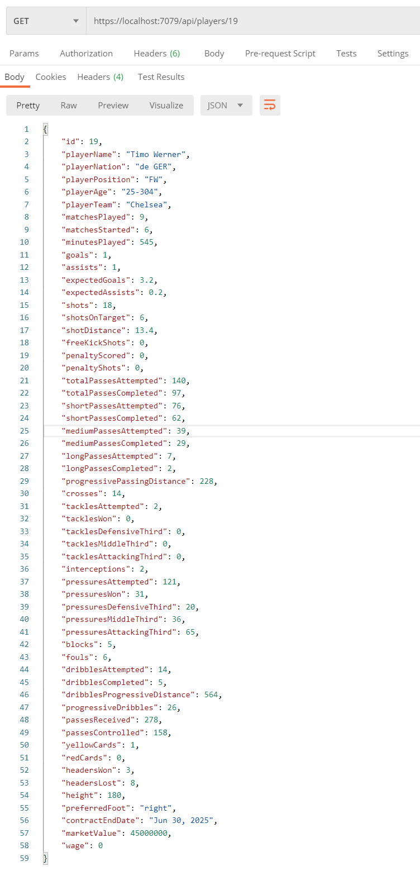
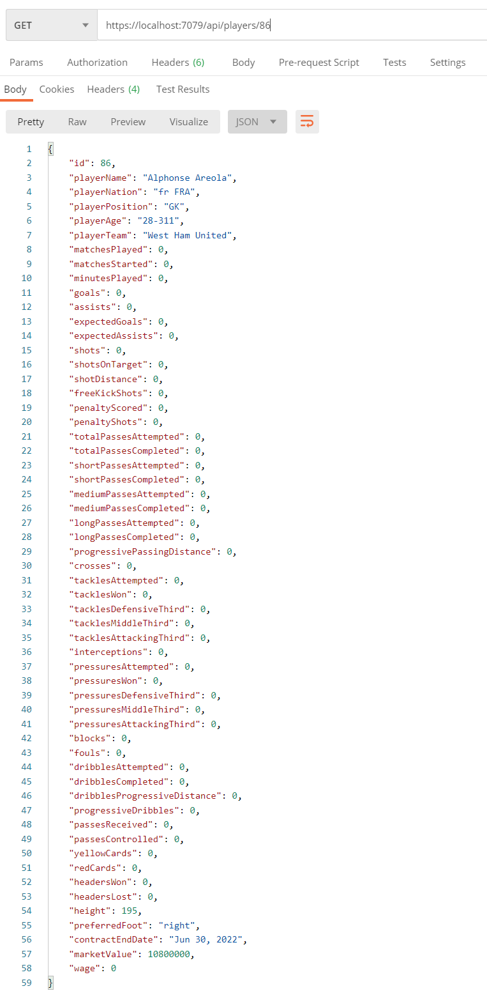
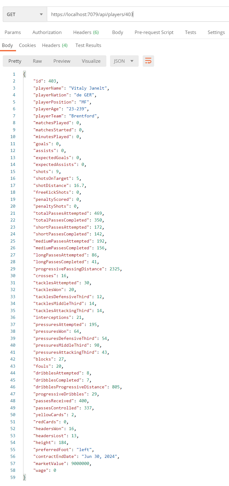

<div id="top"></div>

<!-- PROJECT SHIELDS -->


<!-- PROJECT LOGO -->
<br />
<div align="center">
  <a href="https://github.com/georgefox6/football-stats-api">
    
  </a>

<h3 align="center">Football Stats API</h3>

  <p align="center">
    This project is to create an API that will serve football data based on the information from <a href="https://fbref.com/en/squads">FB REF</a>, <a href="https://www.transfermarkt.co.uk/">Transfermarkt</a> and <a href="https://salarysport.com/football">Salary Sport</a>.
    <br />
    <a href="https://github.com/georgefox6/football-stats-api"><strong>Explore the docs »</strong></a>
    <br />
    <br />
    <a href="https://github.com/georgefox6/football-stats-api">View Demo</a>
    ·
    <a href="https://github.com/georgefox6/football-stats-api/issues">Report Bug</a>
    ·
    <a href="https://github.com/georgefox6/football-stats-api/issues">Request Feature</a>
  </p>
</div>


<!-- TABLE OF CONTENTS -->
<details>
  <summary>Table of Contents</summary>
  <ol>
    <li>
      <a href="#about-the-project">About The Project</a>
      <ul>
        <li><a href="#built-with">Built With</a></li>
      </ul>
    </li>
    <li>
      <a href="#getting-started">Getting Started</a>
      <ul>
        <li><a href="#prerequisites">Prerequisites</a></li>
        <li><a href="#installation">Installation</a></li>
      </ul>
    </li>
    <li><a href="#usage">Usage</a></li>
    <li><a href="#roadmap">Roadmap</a></li>
    <li><a href="#contributing">Contributing</a></li>
    <li><a href="#license">License</a></li>
    <li><a href="#contact">Contact</a></li>
    <li><a href="#acknowledgments">Acknowledgments</a></li>
  </ol>
</details>


<!-- ABOUT THE PROJECT -->
## About The Project

This project is to create an API that will serve football data based on the information from <a href="https://fbref.com/en/squads">FB REF</a>, <a href="https://www.transfermarkt.co.uk/">Transfermarkt</a> and <a href="https://salarysport.com/football">Salary Sport</a>.

<p align="right">(<a href="#top">back to top</a>)</p>

### Contributors

<a href="https://github.com/georgefox6/football-stats-api/graphs/contributors">
  
</a>


### Built With

* [C#](https://docs.microsoft.com/en-us/dotnet/csharp/)
* [DOTNET](https://dotnet.microsoft.com/en-us/)
* [Entity Framework](https://docs.microsoft.com/en-us/ef/)
* [Azure](https://azure.microsoft.com/en-gb/)

<p align="right">(<a href="#top">back to top</a>)</p>


<!-- GETTING STARTED -->
## Getting Started

This project is hosted on azure but you can also run it locally following the instructions below.

### Prerequisites

* .NET
  
  Download <a href="https://dotnet.microsoft.com/en-us/download/dotnet">.Net 6.0</a> by following <a href="https://docs.microsoft.com/en-us/dotnet/core/install/windows?tabs=net60"> this tutorial.</a>

### Installation

1. Clone the repo
   ```sh
   git clone https://github.com/georgefox6/football-stats-api.git
   ```
2. Open the project files
    ```sh
    cd football-stats-api
    ```
3. Start the api locally
   ```sh
   dotnet run
   ```
4. Use the URL https://localhost:7079/api/players{playerId} to fetch a single player or https://localhost:7079/api/players to get all players 

<p align="right">(<a href="#top">back to top</a>)</p>


<!-- USAGE EXAMPLES -->
## Usage

<p>Here are some examples of the API calls to retrieve specific players. </p>





<p>TODO include some code examples and demos</p>

<p align="right">(<a href="#top">back to top</a>)</p>


<!-- ROADMAP -->
## Roadmap

- [] Add ability to search by player name
- [] Add ability to search by player team
- [] Deploy to Azure
    - [] Add a custom domain
- [] Add team data 
- [] Add a frontend application to view all the data

See the [open issues](https://github.com/georgefox6/football-stats-api/issues) for a full list of proposed features (and known issues).

<p align="right">(<a href="#top">back to top</a>)</p>


<!-- CONTRIBUTING -->
## Contributing

Contributions are what make the open source community such an amazing place to learn, inspire, and create. Any contributions you make are **greatly appreciated**.

If you have a suggestion that would make this better, please fork the repo and create a pull request. You can also simply open an issue with the tag "enhancement".
Don't forget to give the project a star! Thanks again!

1. Fork the Project
2. Create your Feature Branch (`git checkout -b feature/AmazingFeature`)
3. Commit your Changes (`git commit -m 'Add some AmazingFeature'`)
4. Push to the Branch (`git push origin feature/AmazingFeature`)
5. Open a Pull Request

<p align="right">(<a href="#top">back to top</a>)</p>


<!-- LICENSE -->
## License

Distributed under the MIT License. See `LICENSE.txt` for more information.

<p align="right">(<a href="#top">back to top</a>)</p>


<!-- CONTACT -->
## Contact

George Fox - Georgefox1996@gmail.com

Project Link: [https://github.com/georgefox6/football-stats-api](https://github.com/georgefox6/football-stats-api)

<p align="right">(<a href="#top">back to top</a>)</p>


<!-- ACKNOWLEDGMENTS -->
## Acknowledgments

* []()
* []()
* []()

<p align="right">(<a href="#top">back to top</a>)</p>